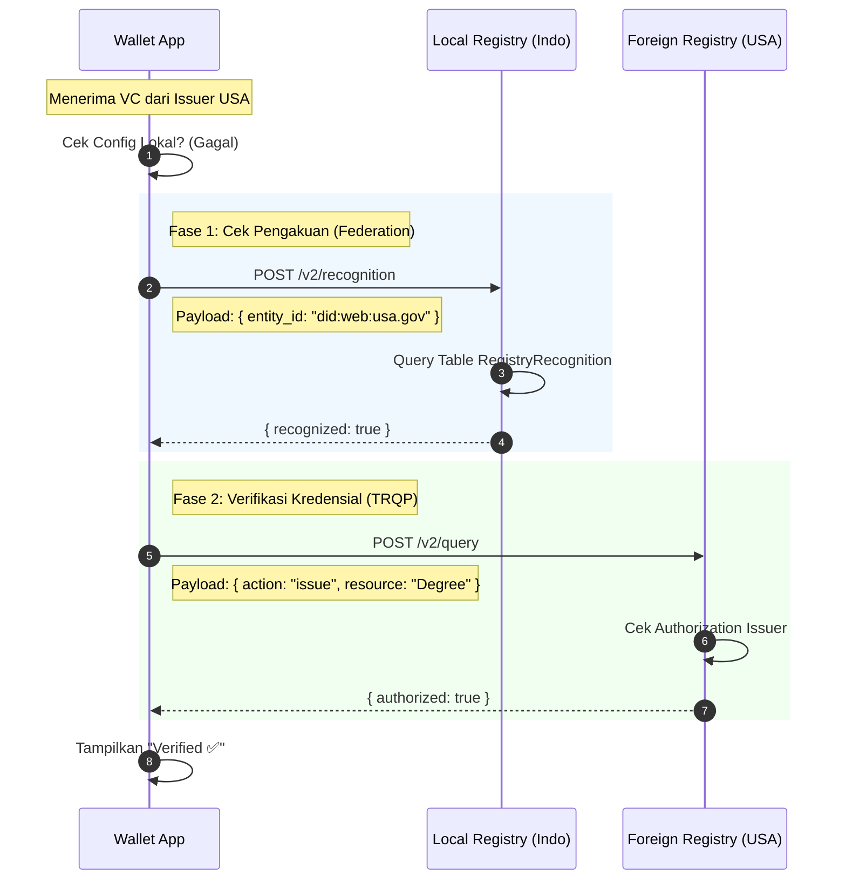

# Strategi Interoperabilitas Lintas Batas: Trust Federation

Dokumen ini menjelaskan implementasi teknis dan operasional untuk **Strategi Federasi (Mutual Recognition)**. Strategi ini memungkinkan Wallet pengguna di Indonesia memvalidasi kredensial dari Otoritas Asing (Cross-Border) dengan memanfaatkan jembatan kepercayaan dari Otoritas Lokal.

---

## 1. Latar Belakang Masalah
Dalam ekosistem SSI, Wallet pengguna dikonfigurasi untuk mempercayai satu set "Trust Anchor" (misal: Kemdikbud RI).
x
*   **Situasi:** Pengguna menerima Verifiable Credential (VC) dari Universitas di Amerika Serikat (Issuer: MIT).
*   **Masalah:** Wallet mengecek konfigurasi lokal dan tidak menemukan `did:web:mit.edu` atau Otoritas Pendidikannya (`did:web:usa.gov`) dalam daftar terpercaya.
*   **Hasil Default:** Wallet menampilkan status ❌ **"Unknown Authority"** atau **"Unverified"**.

## 2. Solusi: Chain of Trust (Rantai Kepercayaan)
Kita tidak memaksa pengguna untuk mempercayai otoritas asing secara manual. Sebaliknya, kita menggunakan mekanisme **Delegated Trust**:

> *"Saya (Wallet) percaya pada Kemdikbud. Kemdikbud mengakui Otoritas USA. Maka, saya percaya pada Otoritas USA."*

Solusi ini memanfaatkan fitur **Registry Recognition** yang sudah tersedia di backend sistem Trust Registry kita.

---

## 3. Prasyarat Sistem (Backend Existing)

Sistem backend kita sudah mendukung fitur ini tanpa perlu coding ulang.

### 3.1 Struktur Database
Tabel `RegistryRecognition` di `schema.prisma` digunakan untuk menyimpan hubungan antar otoritas.

| Kolom | Tipe | Deskripsi | Contoh Data |
| :--- | :--- | :--- | :--- |
| `authorityId` | String | DID Otoritas Lokal (Trust Anchor) | `did:web:kemdikbud.go.id` |
| `entityId` | String | DID Otoritas Asing yang diakui | `did:web:usa.gov` |
| `action` | String | Jenis pengakuan | `"recognize"` atau `"govern"` |
| `recognized` | Boolean | Status pengakuan | `true` |

### 3.2 Endpoint API
Endpoint yang digunakan adalah `POST /v2/recognition`.

---

## 4. Spesifikasi Teknis (API Contract)

Berikut adalah detail payload untuk komunikasi antara Wallet dan Local Trust Registry.

### Request: Recognition Query
Wallet bertanya kepada Otoritas Lokal.

**Endpoint:** `POST /v2/recognition`
**Content-Type:** `application/json`

```json
{
  "query": {
    "authority_id": "did:web:kemdikbud.go.id",  // KEPADA SIAPA: Trust Anchor Lokal
    "entity_id": "did:web:usa.gov",             // TENTANG SIAPA: Trust Anchor Asing
    "action": "recognize",                      // PERTANYAAN: Apakah anda mengakui dia?
    "resource": "governance"                    // KONTEKS: Dalam hal tata kelola
  }
}
```

### Response: Decision
Jawaban dari Otoritas Lokal.

**Status: 200 OK**
```json
{
  "recognized": true,                         // KEPUTUSAN: Ya, saya akui.
  "timestamp": "2023-12-25T10:00:00Z",
  "messages": [
    "Authority is recognized under the 2023 Bilateral Education Agreement."
  ]
}
```

---

## 5. Algoritma Implementasi Wallet (Client-Side)

Berikut adalah logika langkah-demi-langkah yang harus diimplementasikan oleh tim Mobile/Frontend.

### Pseudocode `verifyForeignCredential`

```typescript
/**
 * Memverifikasi Kredensial dengan dukungan Cross-Border Federation
 * @param credential - Objek VC yang diterima
 * @param localAnchorDid - DID Otoritas Lokal (misal: Kemdikbud)
 */
async function verifyWithFederation(credential, localAnchorDid) {
  
  // 1. Ekstrak DID Otoritas dari Kredensial
  // (Biasanya ada di field 'trustRegistry' atau 'issuer')
  const foreignAuthorityDid = extractAuthority(credential); 

  // 2. Cek Config Lokal (Fast Path)
  // Apakah otoritas ini sudah ada di whitelist lokal HP user?
  if (isAuthorityInLocalConfig(foreignAuthorityDid)) {
    return await executeDirectTRQP(foreignAuthorityDid, credential);
  }

  // 3. JIKA GAGAL: Coba Jalur Federasi (Recognition Query)
  console.log(`Otoritas ${foreignAuthorityDid} tidak dikenal. Menghubungi ${localAnchorDid}...`);

  try {
    const recognitionResponse = await api.post('/v2/recognition', {
      query: {
        authority_id: localAnchorDid,
        entity_id: foreignAuthorityDid,
        action: "recognize",
        resource: "governance"
      }
    });

    // 4. Evaluasi Jawaban Federasi
    if (recognitionResponse.recognized === true) {
      // SUCCESS: Otoritas lokal menjamin otoritas asing ini.
      // Lakukan verifikasi TRQP langsung ke server asing sekarang.
      
      console.log("Federasi Berhasil! Melanjutkan verifikasi ke server asing.");
      return await executeDirectTRQP(foreignAuthorityDid, credential);
      
    } else {
      // FAIL: Otoritas lokal pun tidak kenal.
      return { status: "INVALID", reason: "Unknown Authority (Not Recognized Locally)" };
    }

  } catch (error) {
    // Error Jaringan / Server Down
    return { status: "ERROR", reason: "Federation Check Failed" };
  }
}
```

---

## 6. Diagram Alur Data (Sequence Diagram)

Visualisasi interaksi antar sistem.



---

## 7. Kebijakan & Keamanan (Governance & Security)

### 7.1 Kapan Admin Menambahkan Pengakuan?
Admin tidak boleh sembarangan menambahkan data ke tabel `RegistryRecognition`. Hal ini harus didasari oleh:
1.  **Perjanjian Bilateral/Multilateral:** (Misal: MoU Pendidikan Antar Negara).
2.  **Audit Teknis:** Memastikan Trust Registry asing tersebut memenuhi standar keamanan yang setara.

### 7.2 Risiko Keamanan
*   **Trust Transitif:** Dengan mengakui `USA`, kita secara tidak langsung mempercayai semua Issuer yang diakui oleh `USA`.
*   **Mitigasi:** Wallet harus menampilkan indikator visual yang berbeda, misalnya:
    *   Verified Lokal: "Terverifikasi oleh Kemdikbud" (Centang Biru)
    *   Verified Federasi: "Diakui oleh Kemdikbud (via USA)" (Centang Abu-abu/Oranye)

---

## 8. Langkah Selanjutnya (Action Items)

1.  **Backend Team:** Pastikan endpoint `/v2/recognition` sudah aktif dan `CORS` diizinkan untuk akses dari aplikasi Wallet.
2.  **Admin Ops:** Input data dummy otoritas asing ke tabel `RegistryRecognition` untuk keperluan testing.
3.  **Mobile Team:** Implementasikan logika *fallback* pada fungsi verifikasi kredensial sesuai pseudocode di atas.
